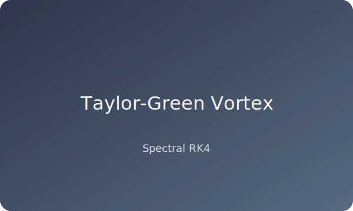

A curated showcase of simulations produced with Navier-Stokes Solvers. Replace the placeholder SVGs under `docs/assets/images/` with high-resolution renders for production deployments.

## Lid-Driven Cavity (Re = 1000)

{: .gallery-img }

- **Solver:** Finite difference (Backward Euler + Newton-Raphson)
- **Grid:** $192 \times 192$
- **Highlights:** Secondary corner vortices, centreline velocity inflection.
- **Reproduce:**
  ```bash
  ./bin/ns_fd_solver --re 1000 --nx 192 --ny 192 --steps 8000 \
      --output results/fd_re1000.dat
  python scripts/plot_solution.py results/fd_re1000.dat -o figures/fd_re1000
  ```

## Taylor-Green Vortex Decay

{: .gallery-img }

- **Solver:** Spectral RK4, periodic domain $2\pi \times 2\pi$
- **Grid:** $256 \times 256$
- **Highlights:** Exponential kinetic energy decay vs analytic solution.
- **Reproduce:**
  ```bash
  ./bin/ns_spectral_solver --config configs/taylor_green.yml
  python scripts/energy_spectrum.py results/spectral_final_solution.dat \
      -o figures/taylor_green_spectrum.png
  ```

## Kelvin–Helmholtz Shear Layer

{: .gallery-img }

- **Solver:** Spectral RK4 with 2/3 dealiasing
- **Grid:** $256 \times 256$
- **Highlights:** Vortex pairing and roll-up, enstrophy cascade.
- **Reproduce:**
  ```bash
  ./bin/ns_spectral_solver --config configs/shear_layer.yml
  python scripts/animate_flow.py "results/shear_layer_step_*.dat" \
      -o figures/shear_layer.gif --fps 24
  ```

## Forced Doubly Periodic Turbulence

{: .gallery-img }

- **Solver:** Spectral with stochastic low-wavenumber forcing
- **Grid:** $256 \times 256$
- **Highlights:** $k^{-5/3}$ spectral slope, dual cascade dynamics.
- **Reproduce:**
  ```bash
  ./bin/ns_spectral_solver --config configs/turbulence_forced.yml
  python scripts/energy_spectrum.py results/spectral_final_solution.dat \
      -o figures/turbulence_spectrum.png
  ```

For additional validation figures and data tables see [Benchmark Results](/benchmark-results/).
